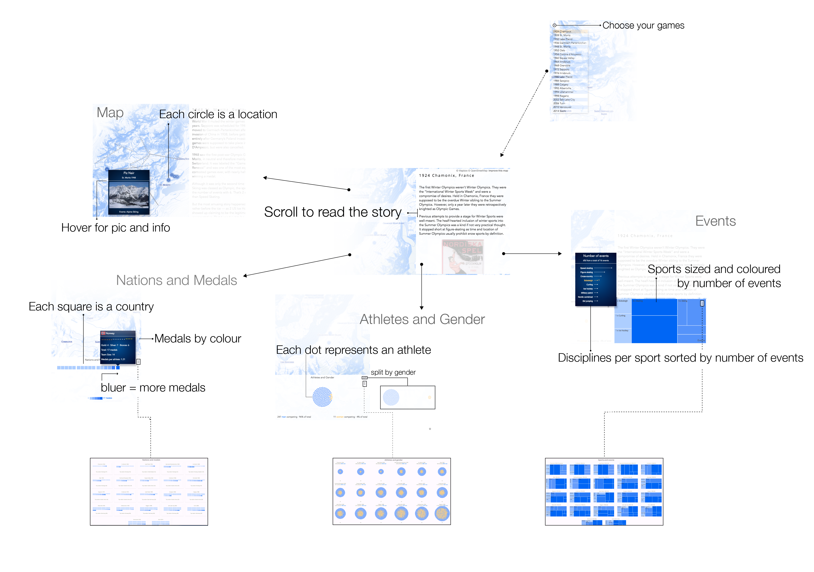
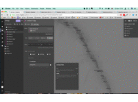

### Winter Olympics

*Winter Olympics* is an interactive data history of the — well — Winter Olympics. It guides the reader through all the 24 Winter Games that happened since 1924. While passing through, it highlights a few so far maybe under-highlighted bits of Olympic history in a story as well as in data.

I mainly blame my honest feelings for map design, white sports and visual storytelling for this interactive. And while there might be more pressing topics to attend to at the minute (Brexit/Trump, dear friend from the future) this might offer a brief moment of tranquility.

It has 5 moving parts all tightly coupled. The main focus is on the story evolving from the 1924 Games in Chamonix to the 2014 Olympics in Sochi. All other pieces are at the story's service as they update accordingly. The map is gratuitiously flying you to each destination as you scroll along. Showing you all event locations of the respective Olympics. In the bottom are three visual representations of Olympic data:

*   The conventional medal count wrapped up in a maybe slightly unconvetional grid-graph.
*   A force-directed ball of athletes giving you an idea of the number of athletes and their gender,
*   and a treemap showing the sports exercised and on hover the individual disciplines per sport sorted by the number of events.

The parts in pictures:

### Why do such thing?

Well, thematically, the next Olympics are happening in Feb 2018, so it's time to prepare. But at least equally important was my friendship with data storytelling plus a combination of webGL, canvas and D3\. A tasty technical soup to slurp ! After peeking into a few pots, I settled for [Mapbox GL](https://www.mapbox.com/mapbox-gl-js/api/) to build the map. And it was very kind to me. It has a clean, well-documented API with a lot of convenience methods saving sweat and tears. It's also based on webGL — the fastest cowboy in town — and uses vector rather than raster tiles to keep the rendering speed up. It also makes map designing a breeze with Mapbox Studio. The fun !

And then there was also [this map](https://www.mapbox.com/blog/ski-mapbox-studio/) designed by [Amy Lee Walton](https://www.mapbox.com/about/team/amy-lee-walton/) which sparked the idea and fuelled the process. Please direct all map design kudos directly to her...

The data was mainly scraped from [Wikipedia](https://en.wikipedia.org/wiki/Winter_Olympic_Games) and [Olympic.org](https://www.olympic.org). Lots of trawling. I would have liked to include some more data — especially of the financial kind — as well as a time-series perspective but I refrained to keep it in scope.

### The process in a gif

Process interesting. The path from blank slate to finished visual follows numerous intersections producing rich yet usually private monologues. While well-written process notes can illuminate this secret world of the developper/designer (devigner?), a small gif saves some paper for now:

Happy days ! and more to follow probably over at [freeCodeCamp](https://medium.freecodecamp.com/d3-and-canvas-in-3-steps-8505c8b27444#.pfx01hww5)